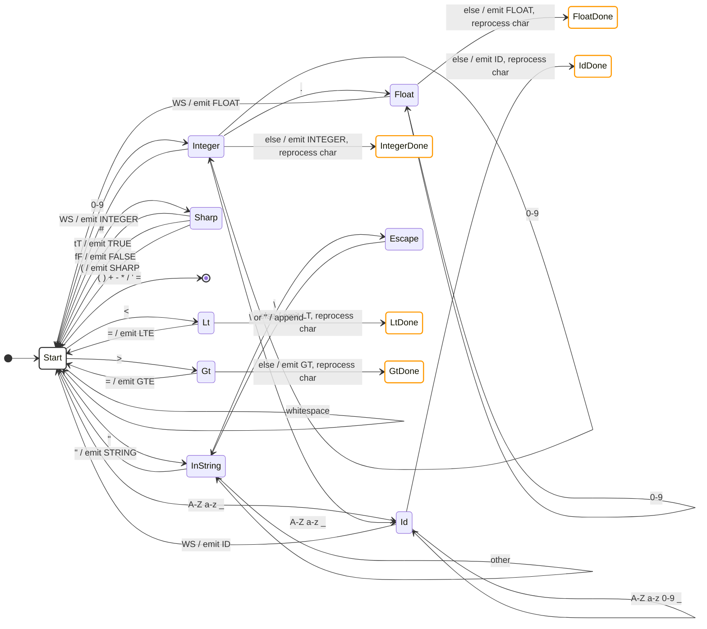

## Notes

- States ending in `Done` are transient markers used by the double-dispatch mechanism (`is_star`) in `filter`. They signal that the current character terminated the previous lexeme and must be processed again as the start of the next lexeme.
- All lexer states are defined as a single `LexerState` enum in `libsrs/src/interpretor/lexical_analyzer.rs`, replacing the legacy `u8` magic numbers.
