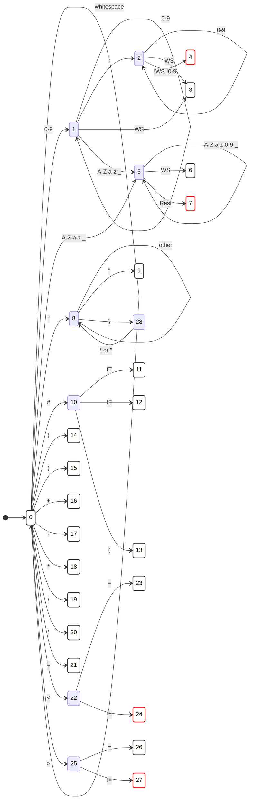

```mermaid
stateDiagram-v2
    direction LR

    [*] --> 0

    classDef accepting fill:#fff,stroke:#333,stroke-width:2px
    classDef error fill:#fff,stroke:#f00,stroke-width:2px

    class 0,3,6,9,11,12,13,14,15,16,17,18,19,20,21,23,26 accepting
    class 4,7,24,27 error

    0 --> 0 : whitespace
    0 --> 1 : 0-9
    0 --> 5 : A-Z a-z _
    0 --> 8 : \"
    0 --> 10 : #
    0 --> 14 : (
    0 --> 15 : )
    0 --> 16 : +
    0 --> 17 : -
    0 --> 18 : *
    0 --> 19 : /
    0 --> 20 : '
    0 --> 21 : =
    0 --> 22 : <
    0 --> 25 : >

    1 --> 1 : 0-9
    1 --> 2 : .
    1 --> 3 : WS
    1 --> 5 : A-Z a-z _

    2 --> 2 : 0-9
    2 --> 3 : WS
    2 --> 4 : !WS !0-9

    5 --> 5 : A-Z a-z 0-9 _
    5 --> 6 : WS
    5 --> 7 : Rest

    8 --> 8 : other
    8 --> 9 : \"
    8 --> 28 : \

    10 --> 11 : tT
    10 --> 12 : fF
    10 --> 13 : (

    22 --> 23 : =
    22 --> 24 : !=

    25 --> 26 : =
    25 --> 27 : !=

    28 --> 8 : \\ or \"
```
