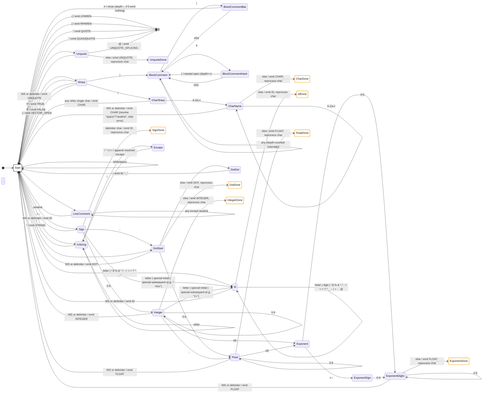

## Notes

- States ending in `Done` are transient markers used by the double-dispatch mechanism (`is_star`) in `filter`. They signal that the current character terminated the previous lexeme and must be processed again as the start of the next lexeme.
- All lexer states are defined as a single `LexerState` enum in `libsrs/src/interpretor/lexical_analyzer.rs`, replacing the legacy `u8` magic numbers.
- `BlockComment` requires an internal depth counter to correctly match nested `#| ... #| ... |# ... |#` sequences; it cannot be modeled as a pure finite automaton with one state per nesting level.
- Identifiers starting with `+` or `-` are handled pragmatically (beyond strict R5RS grammar) to accept common real-world identifiers such as `->string`, `1+`, `list->vector`, matching the behavior of implementations like MIT Scheme and Guile.
- Number support in this subset covers signed integers/floats and exponent notation (`1e10`, `-3.2e-5`). Rationals (`1/2`) and radix/exactness prefixes (`#x`, `#e`, `#i`, `#b`, `#o`, `#d`) are explicitly out of scope for now.
- Datum comments (`#;`) are intentionally excluded from this diagram: they require discarding the *next full datum*, not just the next token, so they cannot be resolved at the lexical level alone. This would need cooperation from the parser/translator if introduced later.
- Character literals support the minimal R5RS name set: `space` and `newline`, plus any single character after `#\`. An unrecognized multi-letter name (e.g. `#\foobar`) is an explicit lexical error, not a silent fallback.
</content>
